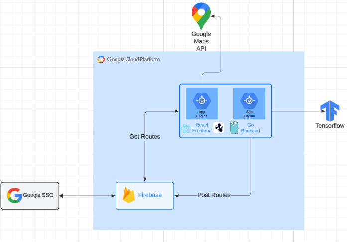
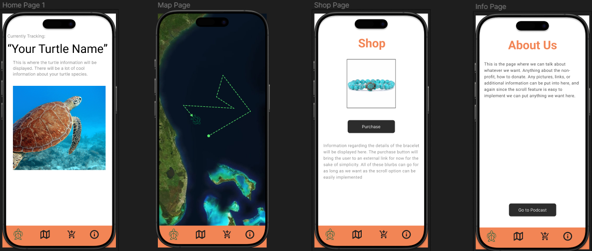

# Turtle Up Tracking

Welcome to Group-12's Public Repo Homepage!

Public Website URL: [https://nguyenm8.github.io/group-12-public-website/](https://nguyenm8.github.io/group-12-public-website/)

### Table of Contents

1. [Product Description](#product-description)
2. [Project Links](#project-links)
3. [Sponsor Information](#sponsor-information)
4. [Team Members](#team-members)
5. [Technology Stack and Architecture](#technology-stack-and-architecture)
   - [Frontend](#frontend)
   - [Backend](#backend)
   - [Database](#database)
   - [Architecture Diagram](#architecture-diagram)
6. [Development Progress](#development-progress)
   - [Current App Design](#current-app-design)
7. [Direction and Prospects](#direction-and-prospects)
   - [Priorities](#priorities)
   - [Features](#features)
   - [Other Actions](#other-actions)

---

## Product Description

Turtle Up Tracking is a mobile app built with React Native and Firebase. It enables users to track turtles in real time while providing ways to support the Turtle Up organization. The app offers information on turtles, options to purchase Turtle Up products, donation capabilities, and access to additional resources about the organization.

## Project Links:

- Frontend Repo: [https://github.com/thecalebmoody/turtle-up-tracking-frontend](https://github.com/thecalebmoody/turtle-up-tracking-frontend)
- Backend Repo: [https://github.com/thecalebmoody/turtle-up-tracking-backend](https://github.com/thecalebmoody/turtle-up-tracking-backend)
- Team 12's Trello Board: [https://trello.com/b/8H3GfL1d/turtle-up-tracking-app-android](https://trello.com/b/8H3GfL1d/turtle-up-tracking-app-android)

## Sponsor Information

- **Sponsor**: **Corinne Brion** - [cbrion1@udayton.edu](mailto:cbrion1@udayton.edu), [admin@turtleup.org](mailto:admin@turtleup.org), (541)-531-3770
- **Website**: [https://turtleup.org](https://turtleup.org)

Turtle Up is a nonprofit organization with 501c3 status. Through innovative educational programs, eco-trips, advocacy, and collaboration, the primary purpose of Turtle Up is to protect the well-being of sea turtles and their habitats.

## Team Members

- **Caleb Moody** (Team Lead) - [moody.caleb@gmail.com](mailto:moody.caleb@gmail.com)
- **Zach Rice** (Full Stack Developer) - [ricez1@udayton.edu](mailto:ricez1@udayton.edu)
- **Iman Motlagh** (Full Stack Developer) - [motlaghi1@udayton.edu](mailto:motlaghi1@udayton.edu)
- **Michael Nguyen** (Full Stack Developer) - [nguyenm8@udayton.edu](mailto:nguyenm8@udayton.edu)

---

## Technology Stack and Architecture

### Frontend:

- **Framework**: React Native
  - Framework for developing mobile applications (iOS and Android) on a single codebase
  - Bridges JavaScript (in our case TypeScript) code to platform-native components
- **Metaframework**: Expo
  - Framework built on top of React Native, a wrapper
  - Allows for prototyping and deployment without needing to set up native development environments like Xcode or Android Studio
  - **Expo Go**: Mobile app that allows for preview and testing in real time
- **Language**: TypeScript
  - JavaScript with static typing
- **Maps**: Google Maps API, react-native-maps
  - Maps APIs for displaying locations and paths

### Backend:

- **Go**
  - Mainly used for handling POST requests to send data to Firebase
  - Decided for future-proofing, has extensive documentation, allows for implementation of AI features

### Database:

- **Firebase**
  - Shared database with other Turtle Up group
  - Utilize Firebase SDK to handle GET requests to retrieve data
  - Decided for Firebase's efficient real-time updates to clients

### Architecture Diagram:

## Development Progress

### Current App Design:

- **Home**: General information on turtles the user has supported through purchasing the Turtle Up bracelets
- **Map**: Turtle locations and paths
- **Shop**: Purchase items and donate to Turtle Up
- **About**: Resources about Turtle Up

## Direction and Prospects

### Priorities

- Finalize basic functionality of the app
- Implement sign-up, authentication, and database functionality
- Integrate Turtle Up resources (podcasts, donations, links, etc.)

### Features:

- **End of Month 2 Features**:

  - SSO: Users can create an account or link with an available external account (Google, iCloud, etc.)
  - Shop Page: Handling secure transactions
  - Map Integration: Ability to display static data on the map page.

- **Future Features**:
  - Biometric authentication
  - AI implementation
  - Webview integration of Turtle Up Education game

### Other Actions:

- Daily SCRUM meetings with both groups, regularly updating progress
- Team hackathon activity, possibly with other Turtle Up groups
